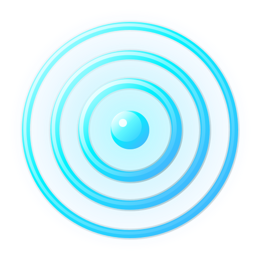

<div align="center">
  
  <h1>Water Ripples</h1>
</div>

<p align="center">
  <a href="https://vite.dev/"></a>
  <a href="https://developer.mozilla.org/en-US/docs/Web/API/WebGL_API"></a>
  <a href="https://developer.mozilla.org/en-US/docs/Web/JavaScript"></a>
  <a href="https://www.npmjs.com/">=10"></a>
</p>

<p align="center">
  <a href="README.md">English</a> · <b>简体中文</b>
</p>

水波小黄花是一个高度交互的网页应用。它具有拟真的 WebGL 水波物理模拟、随波漂浮的鲜艳黄色鸡蛋花，以及一个高质感的无边框液态玻璃控制面板，可在运行中实时折射变形底下的水流与花朵。

<p align="center">
  <a href="#核心特性">核心特性</a> • <a href="#开发指南">开发指南</a>
</p>

## 核心特性

- **拟真水波模拟**：CPU 粗网格波动计算配合 WebGL 片元着色器渲染，支持环境自然水滴波动、漫反射光影以及波峰镜面高光。
- **液态玻璃面板**：采用无边框设计的高质感磨砂玻璃面板，使用 WebGL 镜头渲染器根据 DOM 边界实时折射背景水面，且折射与高光效果随面板淡出动画同步渐隐。
- **程序化鸡蛋花**：在 Canvas 上动态绘制的 5 瓣鸡蛋花，色彩为饱满的蛋黄黄色渐变，加粗的白色花瓣边缘使其在水面中清晰立体。
- **交互式光环指针**：自定义圆环鼠标指针，在点击和滑动时自动缩放并产生涟漪水波。
- **自动多语言适配**：根据用户浏览器语言，自动适配中英文界面。
- **移动端深度适配**：支持移动端触控，且增加了智能 resize 宽高校验，防止手机浏览器因上下拖动显示/隐藏地址栏导致水波物理状态重置。

## 开发指南

### 安装依赖
```bash
npm install
```

### 启动开发服务器
```bash
npm run dev
```

### 打包生产版本
```bash
npm run build
```
